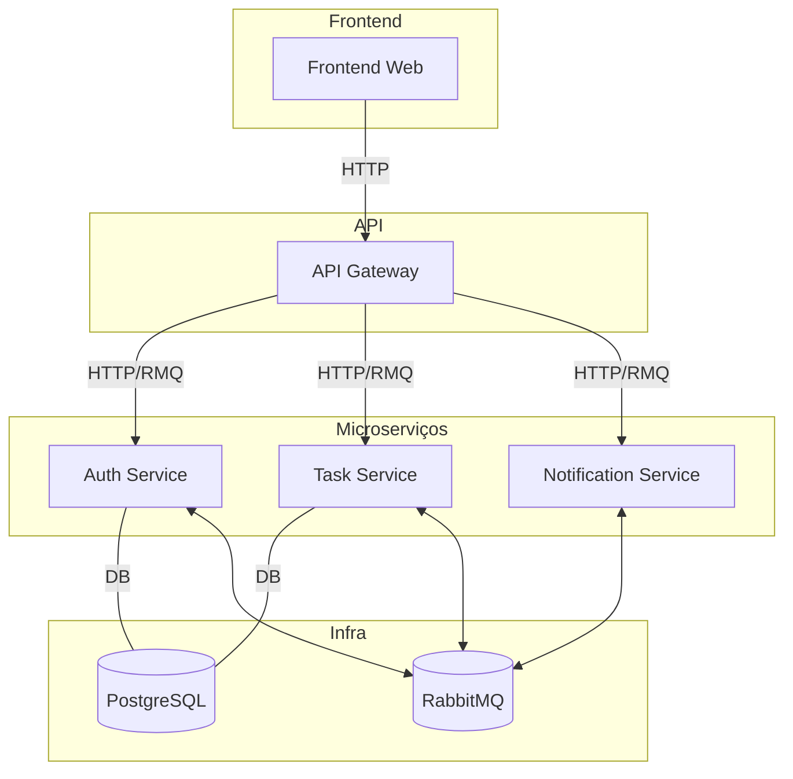

# Desafio Técnico - Jungle Gaming


_Projeto de Microserviços com TurboRepo, NestJS, RabbitMQ, React e Docker_

## Resumo

Este projeto implementa uma arquitetura moderna utilizando TurboRepo, Microserviços com RabbitMQ, Socket.IO, NestJS, React, Shadcn UI, Swagger, Docker e PostgreSQL.
O sistema oferece um serviço de tarefas com login, atualizações em tempo real e comentários.

### Como executar

É necessário ter Docker instalado.

No diretório root do repositório, execute:

```
docker:up:example
```

## Índice

- [Resumo](#resumo)
- [Arquitetura](#arquitetura)
- [Como Executar](#como-executar)
- [Endpoints Principais](#endpoints-principais)
- [Decisões Técnicas e Trade-offs](#decisões-técnicas-e-trade-offs)
- [Problemas Conhecidos e Melhorias Futuras](#problemas-conhecidos-e-melhorias-futuras)
- [Tempo Gasto por Parte](#tempo-gasto-por-parte)
- [Instruções Específicas para Executar](#instruções-específicas-para-executar)
  - [Como Executar](#como-executar-1)
  - [Como Usar](#como-usar)

### Endpoints principais

- Frontend: http://localhost:3005/
- Backend (Swagger): http://localhost:3004/api/docs

## Arquitetura


## Decisões Técnicas e Trade-offs

Segui a arquitetura sugerida, porém adicionei algumas escolhas técnicas visando melhorar organização, segurança e escalabilidade. São elas:

1. Database individual por microserviço, respeitando o princípio de independência total dos serviços.
2. Controle de ambiente centralizado para gerenciar facilmente todas as variáveis necessárias ao deploy.
3. Uso de Terminus para health checks, empacotado em um package reutilizável entre microserviços. Também expõe uma porta HTTP para facilitar o monitoramento via Kubernetes.
4. Zustand para gerenciamento de estado no frontend.
5. Proxy reverso no API Gateway para proteger e centralizar a comunicação com o microserviço de WebSocket.
6. Pino para logs padronizados e de alto desempenho.
7. Validação com Zod, integrada a React Hook Form via zodResolver.
8. TanStack Query para manipular estados assíncronos e manter dados sempre atualizados.
9. Argon2 para criptografia de senhas, devido à sua robustez superior.
10. Centralização dos comandos do RabbitMQ para facilitar escalabilidade.
11. Extensão de DTOs no backend para separar validações e anotações Swagger em camadas distintas.
12. Uso de npm para manter o padrão do projeto, embora pnpm provavelmente fosse uma escolha mais eficiente.

## Problemas Conhecidos e Melhorias Futuras

Dependendo do contexto de uso e das prioridades do sistema, as seguintes melhorias podem ser implementadas:

WebSocket sem resiliência — necessita de fallback com polling em caso de falha.

1. JWT sem controle avançado — seria necessário usar Redis para criar blacklist de refresh tokens e permitir desconectar sessões específicas.
2. Login sem segurança secundária — recomenda-se salvar IP, localização e fingerprint do dispositivo para detectar inconsistências.
3. Conexões diretas entre microserviços — implementar TLS evitaria ataques man-in-the-middle.
4. Falta de sistema de roles/permissões para controle granular do acesso dos usuários.
5. Editor de comentários simples — um WYSIWYG tornaria as tarefas e comentários mais expressivos.
6. LocalStorage sem criptografia — seria conveniente ofuscar informações sensíveis.
7. Problemas em múltiplas abas com WebSocket — um worker de segundo plano ajudaria a unificar conexões.
8. Sistema de notificações incompleto — falta armazenar e exibir notificações históricas.
9. Interface visual simples — uso de Framer Motion tornaria a experiência mais agradável.
10. Ausência de linter ativo nos microserviços.
11. Consideraria trocar o proveedor de autenticação para um externo como Firebase Auth, que permitiria implementar facilmente um serviço dedicado na segurança, e ferramentas como autenticação de dois pasos, autenticação por gmail, autenticação seamless, etc.

> O escopo foi limitado ao solicitado, mas o projeto ainda requer diversas telas (ex.: gestão de usuário), funcionalidades adicionais (ex.: painel de notificações, respostas a comentários, tags, mensagens diretas, tarefas relacionadas), além de melhorias de performance e resiliência.
> Seria interessante também implementar um worker e uma PWA para melhorar usabilidade e funcionalidades offline.

## Tempo Gasto por Parte

| Parte                                | Tempo |
| ------------------------------------ | ----- |
| Configuração inicial e pacotes úteis | 5h    |
| Auth-service                         | 2h    |
| Task-service                         | 5h    |
| Notification-service                 | 2h    |
| API Gateway                          | 8h    |
| Frontend                             | 7h    |
| Integração, testes e refinamento     | 3h    |
| Documentação                         | 1h    |

## Instruções específicas para executar

### Como executar

O repositório utiliza Docker, TurboRepo e arquivos .env.example para facilitar o setup.

1. Vá até o diretório root.
2. Execute:

```
docker:up:example
```

Isso iniciará todo o ecossistema via Docker Compose, incluindo os microserviços, banco de dados, API Gateway e frontend.

### Como usar

Após subir os containers:

- Documentação da API (Swagger): http://localhost:3004/api/docs

- Aplicação Web:
  http://localhost:3005/
